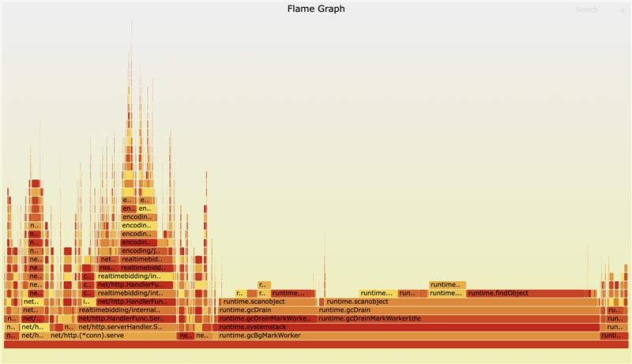
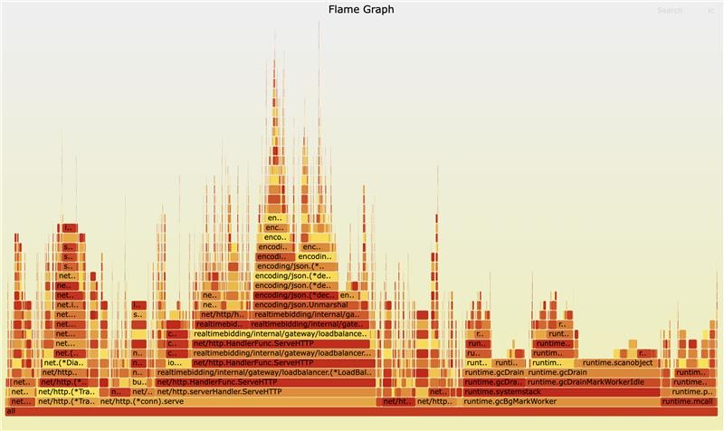

## Large map (of pointers, e.g. string) is bad for Golang garbage collector

I used to build new reverse proxy service in golang, to apply some custom routing logics for upstream
- Specs: 10 nodes, 4 cores/node, ~3KB per request.
- Use httputil.ReverseProxy 
- Initially I used a large in-memory map[string]string (~6GB) for routing logic. However, while profiling, I discovered that it put significant pressure on the Go GC (known issue: [Large maps cause significant GC pauses](https://github.com/golang/go/issues/9477)). So I migrated the map to Redis, this solved the GC pauses and saved RAM (1 instance in Redis vs 10 in-memory). Tradeoff is ~3ms latency increase for lookups. See images for flamecharts with and without the large map in memory
- Before:  

- After:  
