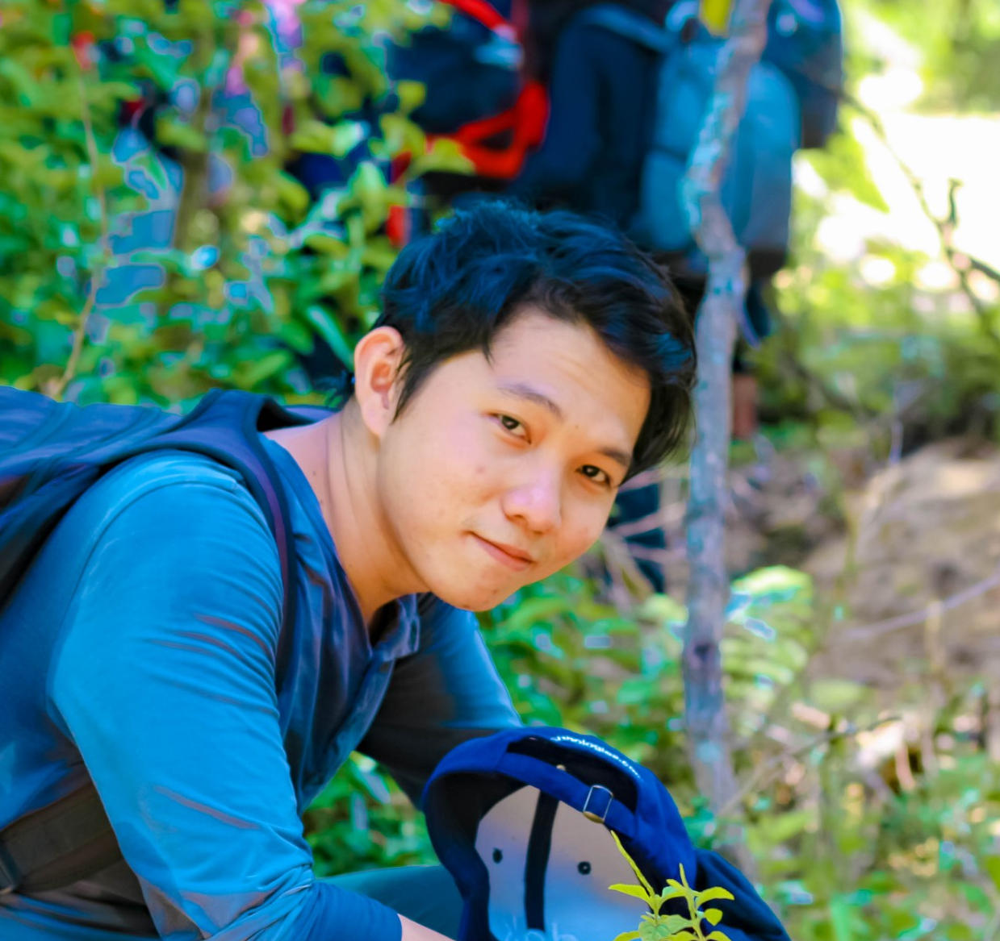

### Hello

<!--   -->
I'm Tam, a software engineer. I like coding, hiking, and beaches. Currently, I'm interested in C++, Golang, Rust, system designs

I graduated from Bach Khoa University as an Automation system engineer. I also worked as a part-time automation system engineer from 3rd year, most of my work were programming for PLC, 6-axis robot controllers, and motion controllers. I also collaborate with mechanial and electrical teams to design and assembly automation systems.

Then I switched my career to Software Engineering. For the last 1.5 years, my work was about a large-scaled distributed system in telecom industry. Most of my daily jobs were develop and maintain SIP framework, network monitoring, blacklisting mechanisms. And my last 4 months, I worked as a customer support engineer, the most important responsibility was to help customer's system recover as soon as posible from issue happens in live node. I also answer queries from customers from all over the world about configuration, behaviors and identify issue for design and maintanence team to fix.

### Projects
Most of my projects are on [github](https://github.com/nttams)
* [DNS client](https://github.com/nttams/dns_client) in Rust
* [DNS server](https://github.com/nttams/dns_server) in Golang
* [Stock crawler](https://github.com/nttams/stock_crawler) in Python
* [Algorithms](https://github.com/nttams/algorithms) in Rust

### Some beautiful places in Vietnam I have visited
* [Ta Nang Phan Dung](https://www.google.com/search?q=ta+nang+phan+dung&tbm=isch)
* [Nui chua chan](https://www.google.com/search?q=nui+chua+chan&tbm=isch)
* [Thac K50](https://www.google.com/search?q=thac+k50&tbm=isch)
* [Quy Nhon Beach](https://www.google.com/search?q=quy+nhon+beach&tbm=isch)

### Contacts
[ngothtam.me@gmail.com](.)  
[linkedin](https://www.linkedin.com/in/ngothtam)

