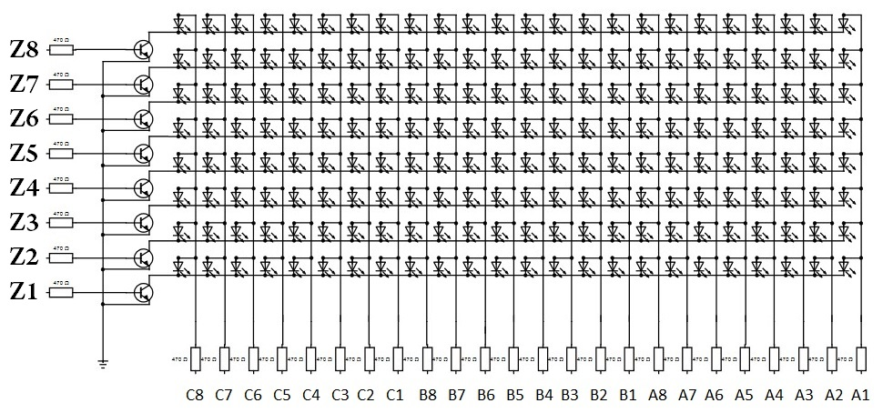
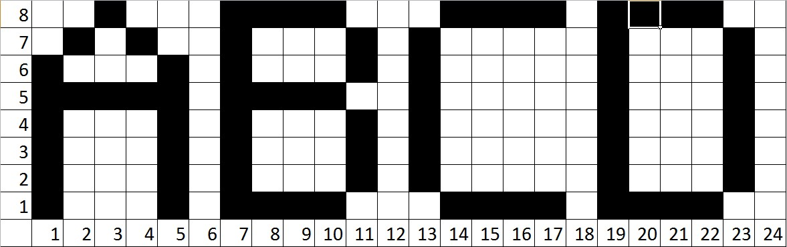
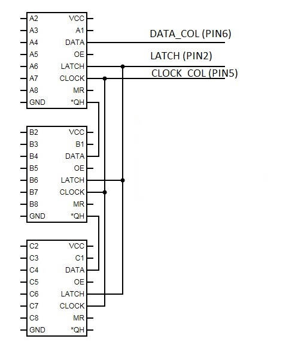
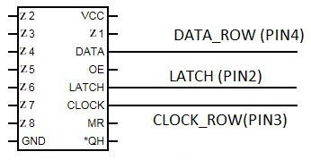
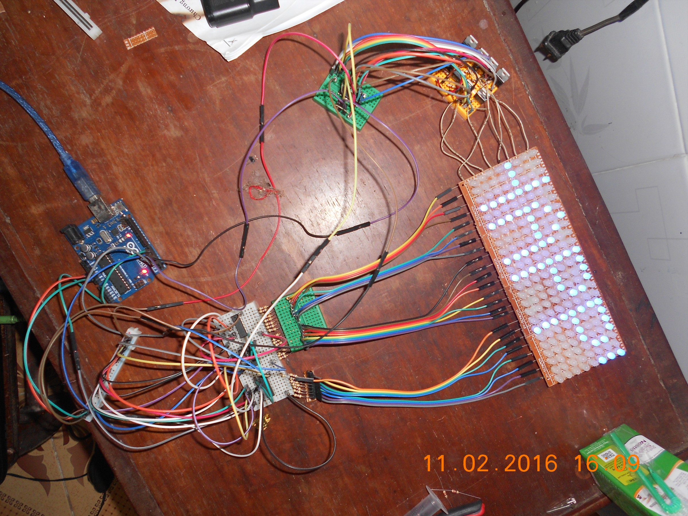



 2016/02/11 



[Original post in Vietnamese](http://arduino.vn/bai-viet/614-dieu-khien-ma-tran-led-24x8-tim-hieu-ki-thuat-quet-led-phan-1)  

Let's talk about how to control a 24x8 LED matrix
#### Prepare
* 24 x 8 = 192 LEDs
* A big PCB board
* A smaller PCB board
* 24 480Ω resistors
* 8 1KΩ resistors
* 8 transistors 2N3904
* 4 IC HC595 (3 for cols and 1 for row)
* 1 Board Arduino Uno

#### Understand LED scanning technique

The matrix has 8 rows and 24 cols as in the figure


To turn on a LED, you need to connect (+) and (-) poles

For example, if you want LED (B2, Z6) to light up, you need to connect B2 to battery (+) and Z6 to (-).
But what if you want to light up LED (B2, Z6) and LED (C3, Z8), you can do as I just said, but the LED (C3, Z6) what be lighting up as well, and we don't want that.

That's why we need LED scanning technique

#### LED scanning technique

Scanning technique instead of supplies power as mentioned, it does in another way. It will "scan", which means it will connect rows Z1, Z2, Z3, Z4, Z5, Z6, Z7, Z8 to (-) one by one. So, only LED on that row can light up (if it's column is connected to (+) as well)

Let's take a look at this table


black is connected, white is not

When row 1 is connected to (0), set 24 values for row 1 in the matrix would be updated. Next row 2, then row 3, ... This progress is very fast, so human eyes can not distigush between updates. The result is that we only see as in the table

You can verify this by adding a delay when switching rows

#### IC HC595 connecting  



Real image  


#### Let's code

```C++
const byte SPEED = 4;
const byte LATCH = 2;
const byte CLOCK_ROW = 3;
const byte DATA_ROW = 4;
const byte CLOCK_COL = 5;
const byte DATA_COL = 6;

//for row, {00000001, 00000010, 00000100, 00001000, 00010000, 00100000, 01000000, 10000000};
const byte ROWS[8] = {1, 2, 4, 8, 16, 32, 64, 128};

byte up[26][8] = {
    {B00111111, B01010000, B10010000, B01010000, B00111111, B00000000, B00000000, B00000000},// A
    {B11111111, B10010001, B10010001, B10010001, B01101110, B00000000, B00000000, B00000000},// B
    {B01111110, B10000001, B10000001, B10000001, B10000001, B00000000, B00000000, B00000000},// C
    {B11111111, B10000001, B10000001, B10000001, B01111110, B00000000, B00000000, B00000000},// D
    {B11111111, B10010001, B10010001, B10010001, B10010001, B00000000, B00000000, B00000000},// E
    {B11111111, B10010000, B10010000, B10010000, B10010000, B00000000, B00000000, B00000000},// F
    {B01111110, B10000001, B10000001, B10001001, B01001110, B00001000, B00000000, B00000000},// G
    {B11111111, B00010000, B00010000, B00010000, B11111111, B00000000, B00000000, B00000000},// H
    {B10000001, B10000001, B11111111, B10000001, B10000001, B00000000, B00000000, B00000000},// I
    {B10000011, B10000001, B11111111, B10000000, B10000000, B00000000, B00000000, B00000000},// J
    {B11111111, B00011000, B00100100, B01000010, B10000001, B00000000, B00000000, B00000000},// K
    {B11111111, B00000001, B00000001, B00000001, B00000001, B00000000, B00000000, B00000000},// L
    {B11111111, B01000000, B00100000, B01000000, B11111111, B00000000, B00000000, B00000000},// M
    {B11111111, B01000000, B00100000, B00010000, B11111111, B00000000, B00000000, B00000000},// N
    {B01111110, B10000001, B10000001, B10000001, B01111110, B00000000, B00000000, B00000000},// O
    {B11111111, B10010000, B10010000, B10010000, B01100000, B00000000, B00000000, B00000000},// P
    {B01111110, B10000001, B10000001, B10000101, B01111110, B00000001, B00000000, B00000000},// Q
    {B11111111, B10011000, B10010100, B10010010, B01100001, B00000000, B00000000, B00000000},// R
    {B01100001, B10010001, B10010001, B10010001, B01001110, B00000000, B00000000, B00000000},// S
    {B10000000, B10000000, B11111111, B10000000, B10000000, B00000000, B00000000, B00000000},// T
    {B11111110, B00000001, B00000001, B00000001, B11111110, B00000000, B00000000, B00000000},// U
    {B11111100, B00000010, B00000001, B00000010, B11111100, B00000000, B00000000, B00000000},// V
    {B11111111, B00000010, B00000100, B00000010, B11111111, B00000000, B00000000, B00000000},// W
    {B11000011, B00100100, B00011000, B00100100, B11000011, B00000000, B00000000, B00000000},// X
    {B11100000, B00010000, B00001111, B00010000, B11100000, B00000000, B00000000, B00000000},// Y
    {B10000111, B10001001, B10010001, B10100001, B11000001, B00000000, B00000000, B00000000} // Z
};

byte num[10][8] = {
  {B01111110, B10000001, B10000001, B10000001, B01111110, B00000000, B00000000, B00000000},// 0
  {B00100001, B01000001, B11111111, B00000001, B00000001, B00000000, B00000000, B00000000},// 1
  {B01000011, B10000101, B10001001, B10010001, B01100001, B00000000, B00000000, B00000000},// 2
  {B01000001, B10010001, B10010001, B10010001, B01101110, B00000000, B00000000, B00000000},// 3
  {B11110000, B00010000, B00010000, B11111111, B00000000, B00000000, B00000000, B00000000},// 4
  {B11110001, B10010001, B10010001, B10010001, B10001110, B00000000, B00000000, B00000000},// 5
  {B01111110, B10010001, B10010001, B10010001, B10001110, B00000000, B00000000, B00000000},// 6
  {B10000000, B10000000, B10011111, B10100000, B11000000, B00000000, B00000000, B00000000},// 7
  {B01101110, B10010001, B10010001, B10010001, B01101110, B00000000, B00000000, B00000000},// 8
  {B01100000, B10010001, B10010001, B10010001, B01111110, B00000000, B00000000, B00000000} // 9
};

byte specials[5][8] = {
  {B00011000, B00100100, B01000010, B00100001, B01000010, B00100100, B00011000, B00000000},// HEART
  {B00000001, B00000110, B00000000, B00000000, B00000000, B00000000, B00000000, B00000000},// ,
  {B00000001, B00000000, B00000000, B00000000, B00000000, B00000000, B00000000, B00000000},// .
  {B11111101, B00000000, B00000000, B00000000, B00000000, B00000000, B00000000, B00000000} // !
};

byte leds[24];

void copyArr(byte target[8], byte source[8]) {
    for (byte i = 0; i < 8; i++) {
        arget[i] = source[i];
    }
}

void getArrFromChar(char ch, byte arr[8]) {
    byte ind = (byte) ch;

    if ((ind >= 48) && (ind <= 57)) {
        copyArr(arr, num[ind - 48]);
        return;
    }

    if ((ind >= 65) && (ind <= 90)) {
        copyArr(arr, up[ind - 65]);
        return;
    }

    switch (ch) {
        case '$': {
            copyArr(arr, specials[0]);
            break;
        }
        case ',': {
            copyArr(arr, specials[1]);
            break;
        }
        case '.': {
            copyArr(arr, specials[2]);
            break;
        }
        case '!': {
            copyArr(arr, specials[3]);
            break;
        }
    };
}

void addChar(char chr) {
    byte arr[8];
    getArrFromChar(chr, arr);
    for (byte i = 0; i < 8; i++) {
        if (arr[i] != 0) {
            addCol(arr[i]);
        }
    }
    addCol(0);
}

void addCol(byte col) {
    moveLeft();
    leds[23] = col;
    show(leds, SPEED);
}

void moveLeft() {
    for (byte i = 0; i < 23; i++) {
        leds[i] = leds[i + 1];
    }
}

void parseString(String s) {
    s += "      ";
    for (byte i = 0; i < s.length(); i++) {
    if (s.charAt(i) == ' ') {
        addCol(0);
        addCol(0);
    } else {
        addChar(s.charAt(i));
    }
    }
}

void show(byte leds[24], byte hold) {
    for (byte k = 0; k < hold; k++) {
        for (byte i = 0; i < 8; i++) {
            byte d[3] = {0, 0, 0};

            for (byte j = 0; j < 24; j++) {
                d[j / 8] = d[j / 8] | ((leds[j] >> i & 1) * ROWS[7 - j % 8]);
            }

            digitalWrite(LATCH, LOW);
            shiftOut(DATA_ROW, CLOCK_ROW, LSBFIRST, ROWS[i]);
            shiftOut(DATA_COL, CLOCK_COL, MSBFIRST, d[0]);
            shiftOut(DATA_COL, CLOCK_COL, MSBFIRST, d[1]);
            shiftOut(DATA_COL, CLOCK_COL, MSBFIRST, d[2]);
            digitalWrite(LATCH, HIGH);
            // uncomment this if you want to learn how LED scanning works
            // delay(10);
        }
    }
}

void initPin() {
    pinMode(LATCH, OUTPUT);
    pinMode(CLOCK_COL, OUTPUT);
    pinMode(DATA_COL, OUTPUT);
    pinMode(CLOCK_ROW, OUTPUT);
    pinMode(DATA_ROW, OUTPUT);
}

void setup() {
    Serial.begin(9600);
    initPin();
}

void loop() {
    parseString("HAPPY NEW YEAR 2016");
}

```

#### That's all, enjoy.


