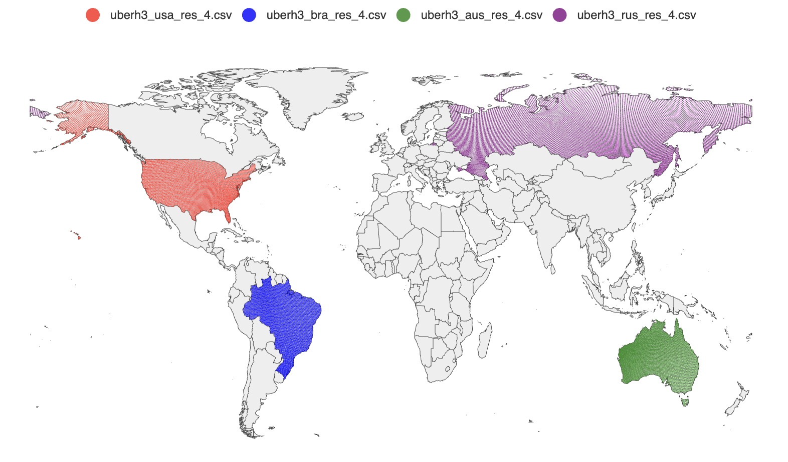

# Mapping Country Boundaries to H3 Hexagonal Grids

Many geospatial systems need to check whether a user's location falls within a target region. One common approach is to store country boundaries as polygons, then run a point-in-polygon query at runtime. This works, but polygon containment checks are expensive, especially when you run them millions of times per second across thousands of campaigns

A better approach: precompute the answer. Convert each country boundary into a set of discrete cell IDs. At query time, you only need to check if a cell ID is in a set, which is a fast hash lookup

[geodata](https://github.com/nttams/geodata) is a small Go tool that does this precomputation. It takes country boundary polygons from Natural Earth and fills them with Uber H3 hexagonal cells, writing the results to CSV files

## What Is H3?

[H3](https://h3geo.org/) is Uber's open-source hexagonal grid system. The globe is divided into hexagonal cells at multiple resolutions. Each cell has a unique 64-bit integer ID. At resolution 4, each cell covers about 1,770 km2. Higher resolutions give finer granularity but more cells per country

Hexagons are a good fit for this use case because they tile the plane uniformly. Every cell has six equidistant neighbors, so there is no directional bias when querying nearby cells

## How It Works

The tool does three things: fetch country boundary polygons, fill each polygon with H3 cells, and write the results to CSV

<div style="display:flex;flex-direction:column;align-items:center;font-family:system-ui,sans-serif;margin:24px 0;">
  <div style="background:#f5f5f5;border:1.5px solid #c0c0c0;border-radius:6px;padding:9px 20px;text-align:center;font-size:13px;color:#2d2d2d;min-width:240px;">Fetch GeoJSON<span style="display:block;font-size:11px;color:#888;margin-top:2px;">Natural Earth country boundaries</span></div>
  <div style="display:flex;justify-content:center;margin:3px 0;"><svg width="14" height="20" viewBox="0 0 14 20"><line x1="7" y1="0" x2="7" y2="13" stroke="#c0c0c0" stroke-width="1.5"/><polygon points="7,20 2,12 12,12" fill="#c0c0c0"/></svg></div>
  <div style="background:#f5f5f5;border:1.5px solid #c0c0c0;border-radius:6px;padding:9px 20px;text-align:center;font-size:13px;color:#2d2d2d;min-width:240px;">Parse Features<span style="display:block;font-size:11px;color:#888;margin-top:2px;">extract polygons per ISO_A3 country code</span></div>
  <div style="display:flex;justify-content:center;margin:3px 0;"><svg width="14" height="20" viewBox="0 0 14 20"><line x1="7" y1="0" x2="7" y2="13" stroke="#c0c0c0" stroke-width="1.5"/><polygon points="7,20 2,12 12,12" fill="#c0c0c0"/></svg></div>
  <div style="background:#f5f5f5;border:1.5px solid #c0c0c0;border-radius:6px;padding:9px 20px;text-align:center;font-size:13px;color:#2d2d2d;min-width:240px;">Fill Polygons<span style="display:block;font-size:11px;color:#888;margin-top:2px;">H3 PolygonToCells at each resolution</span></div>
  <div style="display:flex;justify-content:center;margin:3px 0;"><svg width="14" height="20" viewBox="0 0 14 20"><line x1="7" y1="0" x2="7" y2="13" stroke="#c0c0c0" stroke-width="1.5"/><polygon points="7,20 2,12 12,12" fill="#c0c0c0"/></svg></div>
  <div style="background:#f5f5f5;border:1.5px solid #c0c0c0;border-radius:6px;padding:9px 20px;text-align:center;font-size:13px;color:#2d2d2d;min-width:240px;">Deduplicate Cells<span style="display:block;font-size:11px;color:#888;margin-top:2px;">map[h3.Cell]bool per country</span></div>
  <div style="display:flex;justify-content:center;margin:3px 0;"><svg width="14" height="20" viewBox="0 0 14 20"><line x1="7" y1="0" x2="7" y2="13" stroke="#c0c0c0" stroke-width="1.5"/><polygon points="7,20 2,12 12,12" fill="#c0c0c0"/></svg></div>
  <div style="background:#f5f5f5;border:1.5px solid #c0c0c0;border-radius:6px;padding:9px 20px;text-align:center;font-size:13px;color:#2d2d2d;min-width:240px;">Write CSV<span style="display:block;font-size:11px;color:#888;margin-top:2px;">cell ID, lat, lng per country file</span></div>
</div>

### Fetching Country Polygons

The GeoJSON source is the [Natural Earth](https://www.naturalearthdata.com/) 1:110m admin-0 dataset, fetched directly from GitHub at startup. Natural Earth is a public domain dataset widely used for cartographic work. The tool falls back to a local copy in the repository if the download fails

Each GeoJSON feature maps to one country. The code reads the `ISO_A3` property as the country identifier. Some countries in the dataset have `-99` as their ISO_A3 value (a Natural Earth convention for disputed or unmapped territories), so the code falls back to the `ISO_A3_EH` property and validates it against a countries library before accepting it

### Filling Polygons with H3 Cells

The core operation is `h3.PolygonToCells(polygon, resolution)`. This returns all H3 cells whose centers fall within the given polygon at the requested resolution

Many countries have non-contiguous territories: islands, overseas regions, exclaves. In GeoJSON these appear as `MultiPolygon` geometries. The code handles this by iterating over each sub-polygon separately and collecting cells from all of them into a single map. The map serves as a deduplication set, since adjacent polygons might produce the same border cells

```
Country A (MultiPolygon)
  ├── Polygon 1 (mainland)  → cells {a, b, c, d}
  ├── Polygon 2 (island 1)  → cells {e, f}
  └── Polygon 3 (island 2)  → cells {d, g}   ← d is a duplicate
                                               → final: {a, b, c, d, e, f, g}
```

### Output Format

Each country gets a CSV file named `h3_res_{resolution}_{iso_a3}.csv` with three columns:

```
id,lat,lng
599690792927657983,52.765347,5.199402
599693744560906239,52.388095,4.899597
...
```

The `id` column is the H3 cell ID as a uint64. The lat/lng columns are the cell's center coordinates, computed by `cell.LatLng()`. These can be loaded directly into a geospatial database or visualized with a tool like [geoplot](https://github.com/nttams/geoplot)



## Using the Output

The intended use is geo-targeting: load each country's cell set into a key-value store or in-memory set, then at query time convert the user's coordinates to an H3 cell ID at the same resolution and check membership

```
user location (lat, lng)
  → h3.LatLngToCell(lat, lng, resolution)  → cell ID
  → set.Contains(cellID)                   → true/false
```

This replaces an expensive point-in-polygon computation with a single hash lookup. The trade-off is coverage at borders: cells are discrete, so a cell on the boundary of a country may or may not be included depending on where its center falls. At resolution 4, each cell is about 1,770 km2, so the maximum border error is on the order of one cell width (~42 km). Higher resolutions reduce this error at the cost of more cells per country
