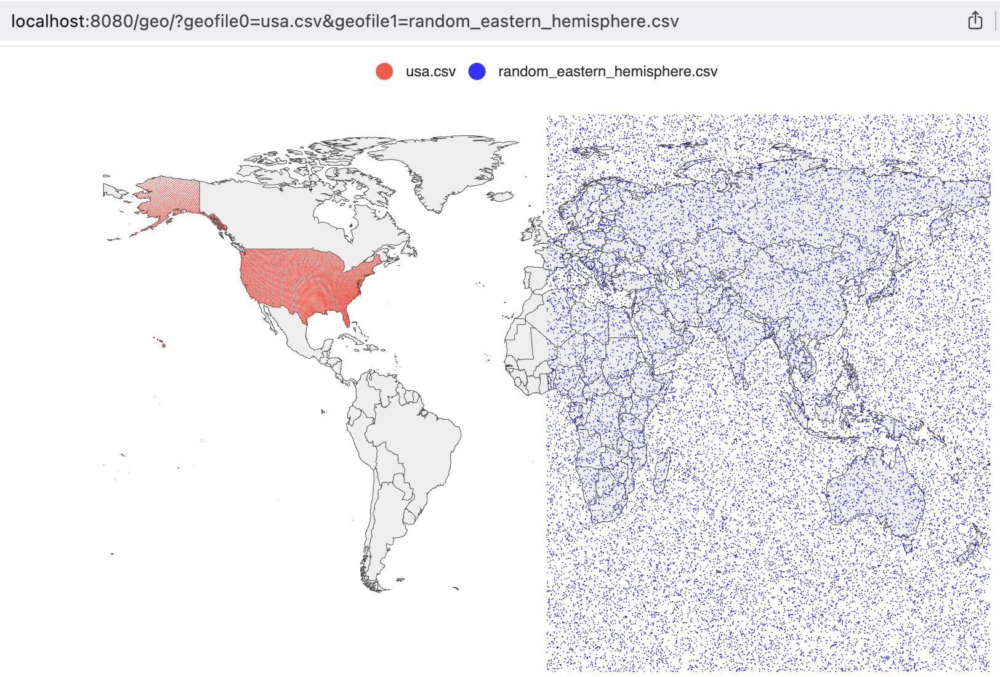

# Visualizing Geospatial CSV Data with geoplot

When working on [geodata](./geodata.md), we needed a way to verify the output: are the H3 cells actually covering the right countries? Eyeballing raw CSV files with thousands of lat/lng rows is not practical. We needed to plot them on a map

[geoplot](https://github.com/nttams/geoplot) is a small Go HTTP server that reads CSV files and renders their coordinates as scatter points on an interactive world map. You pass it file names via query parameters, it serves back a rendered map in the browser



## How It Works

The server exposes a single endpoint: `/geo/`. You specify up to 100 CSV files via query parameters `geofile0`, `geofile1`, and so on. Each file is loaded, parsed, and rendered as a separate series on the map with a distinct color

```
http://localhost:8080/geo/?geofile0=usa.csv&geofile1=latlon.csv
```

<div style="display:flex;flex-direction:column;align-items:center;font-family:system-ui,sans-serif;margin:24px 0;">
  <div style="background:#f5f5f5;border:1.5px solid #c0c0c0;border-radius:6px;padding:9px 20px;text-align:center;font-size:13px;color:#2d2d2d;min-width:240px;">HTTP Request<span style="display:block;font-size:11px;color:#888;margin-top:2px;">/geo/?geofile0=…&geofile1=…</span></div>
  <div style="display:flex;justify-content:center;margin:3px 0;"><svg width="14" height="20" viewBox="0 0 14 20"><line x1="7" y1="0" x2="7" y2="13" stroke="#c0c0c0" stroke-width="1.5"/><polygon points="7,20 2,12 12,12" fill="#c0c0c0"/></svg></div>
  <div style="background:#f5f5f5;border:1.5px solid #c0c0c0;border-radius:6px;padding:9px 20px;text-align:center;font-size:13px;color:#2d2d2d;min-width:240px;">Parse Query Params<span style="display:block;font-size:11px;color:#888;margin-top:2px;">collect file names in order</span></div>
  <div style="display:flex;justify-content:center;margin:3px 0;"><svg width="14" height="20" viewBox="0 0 14 20"><line x1="7" y1="0" x2="7" y2="13" stroke="#c0c0c0" stroke-width="1.5"/><polygon points="7,20 2,12 12,12" fill="#c0c0c0"/></svg></div>
  <div style="background:#f5f5f5;border:1.5px solid #c0c0c0;border-radius:6px;padding:9px 20px;text-align:center;font-size:13px;color:#2d2d2d;min-width:240px;">Load Points per File<span style="display:block;font-size:11px;color:#888;margin-top:2px;">auto-detect lat column, parse lng</span></div>
  <div style="display:flex;justify-content:center;margin:3px 0;"><svg width="14" height="20" viewBox="0 0 14 20"><line x1="7" y1="0" x2="7" y2="13" stroke="#c0c0c0" stroke-width="1.5"/><polygon points="7,20 2,12 12,12" fill="#c0c0c0"/></svg></div>
  <div style="background:#f5f5f5;border:1.5px solid #c0c0c0;border-radius:6px;padding:9px 20px;text-align:center;font-size:13px;color:#2d2d2d;min-width:240px;">Render Geo Chart<span style="display:block;font-size:11px;color:#888;margin-top:2px;">go-echarts scatter on world map</span></div>
  <div style="display:flex;justify-content:center;margin:3px 0;"><svg width="14" height="20" viewBox="0 0 14 20"><line x1="7" y1="0" x2="7" y2="13" stroke="#c0c0c0" stroke-width="1.5"/><polygon points="7,20 2,12 12,12" fill="#c0c0c0"/></svg></div>
  <div style="background:#f5f5f5;border:1.5px solid #c0c0c0;border-radius:6px;padding:9px 20px;text-align:center;font-size:13px;color:#2d2d2d;min-width:240px;">Serve HTML to Browser</div>
</div>

## Column Auto-Detection

The CSV parser does not require a fixed column order. It scans the first data row and finds the first field that parses as a valid latitude (a float between -90 and 90). That column index is stored and reused for every subsequent row. The column immediately to its right is treated as longitude

This means it works with CSV files that have leading ID columns, like the output from geodata:

```
id,lat,lng
599690792927657983,52.765347,5.199402
```

The `id` field is not a valid latitude, so the parser skips it and correctly identifies `lat` as column 1

## Rendering

The chart uses [go-echarts](https://github.com/go-echarts/go-echarts), which wraps Apache ECharts. Each file becomes a named scatter series. Points are sorted by latitude before rendering, which does not change the visual output but makes the series consistent across reloads. The map is interactive: you can zoom and pan in the browser

Colors cycle through a fixed list (`red`, `blue`, `black`), assigned by file index. The file name is used as the series label, so it appears in the legend
