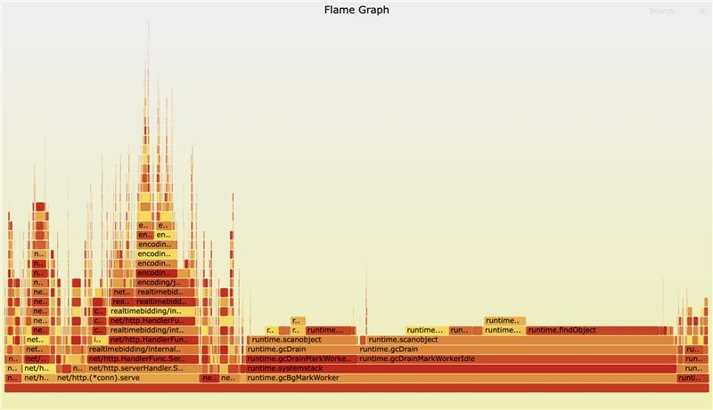
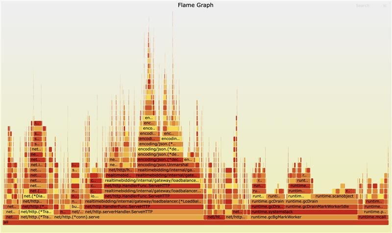

# Large Maps Are Bad for Go GC

If you build high-throughput systems in Go, you will eventually run into a garbage collection (GC) wall. One of the most common, yet surprising, ways to hit this wall is by storing a massive number of items in a built-in Go map. 

I recently dealt with a performance issue in a high-traffic HTTP reverse proxy. The culprit was a large `map[string]string` kept in memory. After changing our approach, CPU utilization dropped significantly and our latency became much more predictable. 

In this post, I want to share why large maps are bad for the Go garbage collector, how we discovered the issue in our production system, and the practical steps you can take to fix it. We will also explore some performance tuning insights for Go maps.

## How Go Garbage Collection Works

To understand why a large map is a problem, we must first understand how Go handles memory. 

Go uses a concurrent mark-and-sweep garbage collector. During every GC cycle, the runtime has to figure out which objects in memory are still being used (live) and which can be safely thrown away. It does this in two main phases:

1. **Mark phase**: The GC starts from "roots" (like global variables and stack variables) and traces every pointer it can find. If it finds a pointer to an object, it marks that object as "alive". It keeps following pointers from object to object until everything reachable is marked.
2. **Sweep phase**: The GC goes through memory and reclaims any space occupied by objects that were not marked as alive.

The critical thing to understand here is that **the cost of the mark phase scales with the number of pointers it has to scan, not the raw number of bytes in memory**. 

If you have a 1 Gigabyte array of pure bytes (`[]byte`), the GC looks at it, sees there are zero pointers inside, and moves on immediately. It takes almost zero time. 
But if you allocate 1 Gigabyte of small objects linked together by millions of pointers, the GC has to chase down every single one of those pointers. That takes a lot of CPU cycles and pauses your application.

This is a well-known issue in the Go community (see [runtime: Large maps cause significant GC pauses](https://github.com/golang/go/issues/9477)). But it still catches many senior developers off guard.

## The Anatomy of a Large Map in Go

Let's look at `map[string]string`. When you create a map with millions of entries, you might think you are just storing keys and values. But under the hood, a Go map is a complex hash table.

A `map[string]string` contains:
- A pointer to the internal `hmap` struct (the header).
- Pointers to an array of buckets. Each bucket holds up to 8 key-value pairs.
- Overflow buckets, which are linked lists of extra buckets if there are collisions. 
- For each entry in the map, there is a key and a value.

Wait, it gets worse. A `string` in Go is not just a blob of text. Under the hood, a `string` is a struct containing two things: a pointer to the actual underlying byte array, and an integer for the length.

So, if you have a `map[string]string` with 10 million entries, you do not just have 10 million items. You have:
- Millions of internal bucket pointers.
- 10 million pointers for the keys (the string headers).
- 10 million pointers for the values.

That is over 20 million individual pointers! During every single GC cycle, the Go standard garbage collector must scan all of them. Even if you never modify the map, the GC does not know that. It has to scan the whole thing every time to make sure memory is still reachable. This completely shreds your CPU cache and slows down the whole runtime.

## My Case Study: The High-Traffic HTTP Reverse Proxy

I recently worked on an HTTP reverse proxy service written in Go. Its job was to apply custom routing logic, mapping incoming requests to correct upstream services. We describe the routing system in detail in [Custom Routing](./rtb-custom-routing.md). This GC issue is one of the things we ran into while building it.

The scale was significant:
- We ran 10 nodes, each with 4 CPU cores.
- The service processed around 30,000 queries per second (QPS) globally.
- The payload was roughly 3KB per JSON request.
- The hard requirement was sub-100ms latency.

To make routing fast, we decided to load all the routing rules into a `map[string]string` when the process started. Fast in-memory lookup, right? It worked beautifully at first.

But over time as the routing rule set grew to millions of entries, things got weird.
We noticed periodic CPU spikes across the nodes. At first, the Prometheus monitoring charts looked okay because our metrics were averaged over a 5-minute interval, which smoothed out the spikes. A flat chart hid the micro-stutters.

Eventually, we saw increased tail latency (P99). Requests that should take 10ms were taking much longer. 

I grabbed a profiling tool (`pprof`) to see where the CPU time was going. I expected to see JSON parsing or network I/O taking up the time. Instead, I saw `runtime.gcDrainMarkWorker` and `runtime.gcDrainMarkWorkerIdle` dominating the CPU profile. The garbage collector was working overtime just to keep up with our static routing map.

Here is the workflow of the old system:
`Incoming Request -> Go HTTP server -> Lookup rule in Large Map -> Forward to Upstream`

### Reproducing the Issue

To prove this was the root cause, I wrote a simple script to benchmark the GC pause time with different map sizes. 

```go
package main

import (
	"fmt"
	"runtime"
	"time"
)

func run(n int) {
	// Pre-allocate the map to avoid resizing cost during setup
	routes := make(map[string]string, n)

	// Populate the map with n items
	for i := range n {
		routes[fmt.Sprintf("key-%d", i)] = fmt.Sprintf("value-%d", i)
	}

	const runs = 10
	var totalPause time.Duration
	
	// Trigger GC manually and measure how long it takes
	for range runs {
		start := time.Now()
		runtime.GC()
		pause := time.Since(start)
		totalPause += pause
	}

	avgMs := float64(totalPause.Milliseconds()) / float64(runs)
	fmt.Printf("n=%d | avg GC pause=%.3fms\n", n, avgMs)

	// Prevent the map from being garbage collected by compiler optimization
	_ = routes["key-0"] 
}

func main() {
	run(1_000_000)
	run(10_000_000)
	run(20_000_000)
}
```

Running this script gave very clear results:

```text
% go run ./...
n=1000000 | avg GC pause=10.200ms
n=10000000 | avg GC pause=103.300ms
n=20000000 | avg GC pause=342.600ms
```



As you can see, the GC pause time grows linearly with the number of items in the map. A 342ms pause in a system that requires sub-100ms latency is an absolute disaster.

## Finding a Solution

Once we knew the huge `map[string]string` was the problem, we had to find a way to fix it. We explored a few different approaches.

### Approach 1: Map without Pointers
Go has an optimization: if a map's keys and values do not contain any pointers, the GC will not scan its contents. For example, a `map[int]int` does not require scanning. However, since we needed strings, it was not straightforward. We could map a hash of the string (an integer) to an offset in a massive byte array, but this meant writing a custom memory allocator. It is complex and fragile.

### Approach 2: Off-Heap Caching Libraries
We considered using libraries like `BigCache` or `FreeCache`. These libraries avoid GC overhead by allocating large byte arrays (which have no pointers) and managing the memory layout themselves. They serialize your strings into bytes and store them in the array, hashing the keys to integer offsets. 
This is a great technique if you strictly need your cache to stay inside the Go process memory for extreme performance. But it still consumes a large amount of RAM on every single node. If we have 10 nodes, we are duplicating this massive dataset 10 times in memory.

### Approach 3: External Store (Redis)
Instead of keeping the data in memory, why not move it out of the Go process entirely? Redis is blazing fast, single-threaded, and built exactly for this use case. By moving the routing rules to Redis, we would completely remove the data from Go's memory space, freeing the GC.

## The Move to Redis

We decided to go with Redis. 

The new workflow looks like this:
`Incoming Request -> Go HTTP server -> Lookup rule in Redis -> Forward to Upstream`



The results were immediate and drastic:
1. **GC pauses dropped significantly.** Since the large map was gone, the Go GC only had to process short-lived request objects. Pause times fell back to roughly 1-2 milliseconds.
2. **Overall RAM usage decreased.** Instead of keeping a huge map duplicated across 10 Go nodes, we kept a single authoritative copy in a centralized Redis cluster. This saved us a lot of infrastructure cost.
3. **Latency trade-off.** Fetching from memory takes nanoseconds. Fetching from Redis over the network takes about 1-2 milliseconds. Our total latency increased slightly, but the variance dropped. We stopped hitting unpredictable 300ms latency spikes caused by GC pauses. A consistent 2ms penalty was perfectly acceptable for our sub-100ms budget.

### Results and Trade-offs

Here is a quick summary of how the two approaches compare in our context:

| Aspect | Go map[string]string | Redis |
| :--- | :--- | :--- |
| **GC Pressure** | Extremely High (scans millions of pointers) | Very Low (no pointers in Go) |
| **Lookup Latency** | Nanoseconds (Local RAM) | 1–3 Milliseconds (Network I/O) |
| **Memory Per Node** | High (Duplicated across instances) | Low (Centralized storage) |
| **Horizontal Scaling** | Hard (Memory limit bottleneck) | Easy (State is extracted) |
| **Update Mechanism** | Requires a sync channel or restart | Instant across all apps |

## Performance Tuning Insights for Go

If you are dealing with large datasets in Go, here are some practical, senior-level tips to keep the garbage collector happy:

1. **Avoid Pointers in Large Collections:** If you must keep a large map in memory, try to ensure the keys and values are simple value types (like `int`, `int64`, or fixed arrays `[16]byte`). If there are no pointers, the GC does not have to scan the map's contents.
2. **Use Off-Heap Caches:** Open-source projects like `allegro/bigcache` or `coocood/freecache` are heavily optimized to solve this exact problem. They use `map[int]uint32` under the hood and manage their own byte arenas to bypass the GC completely. 
3. **Profile Early and Often:** Do not guess performance. Use `net/http/pprof` in your staging and production environments. Continuous profiling will highlight GC bottlenecks long before they become a critical outage. Look carefully at `runtime.gcDrain` in your flame graphs.

## Summary

When building systems in Go, memory layout matters just as much as algorithm complexity. 

The garbage collector is a fantastic tool that saves us from manual memory management bugs (like use-after-free or memory leaks), but it is not magic. It has to scan every pointer you create. 

If you build a massive `map[string]string` with 20 million items, you are asking the GC to scan 40 million pointers every few seconds. Your application will choke.

To fix this:
- **Profile your program.** The sooner you look at flame graphs, the better. Do not rely entirely on averaged metrics like a 5-minute Prometheus aggregation, because it will hide CPU spikes.
- **Avoid large maps with pointers in memory.** If you need an in-memory cache, look at off-heap solutions like BigCache.
- **Use external stores.** For large, static, or shared datasets, systems like Redis or Memcached are purpose-built for the job. Do not reinvent the wheel inside your Go application unless you absolutely have to.

Understanding how your tools work under the hood is what separates a working system from a highly-scalable, resilient system. Keep your pointers scarce, and your Go programs will fly.

> AI was used to help refine and polish this article based on factual information
