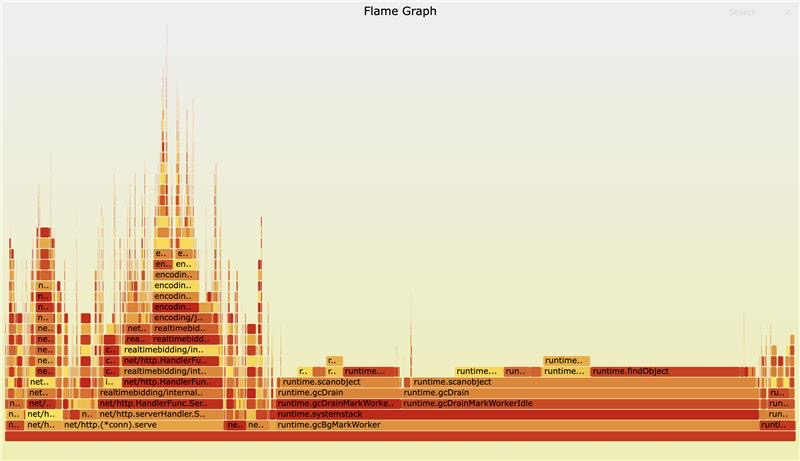
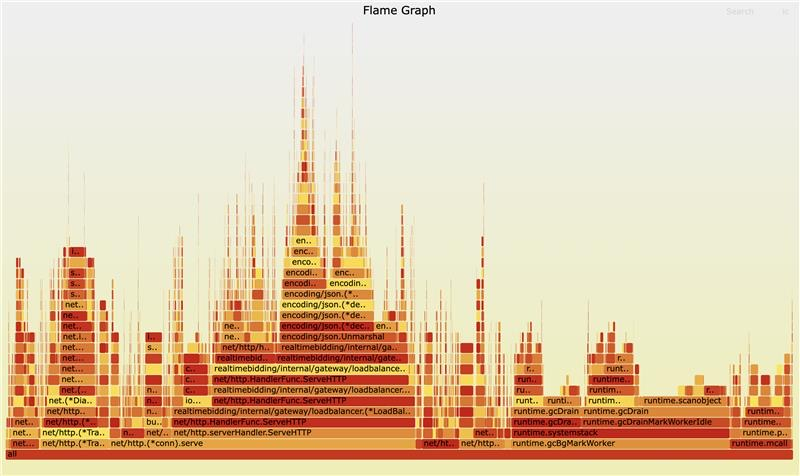

# Large Maps Are Bad for Go GC

## How Go GC Works

Go uses a concurrent mark-and-sweep garbage collector. During every GC cycle, the runtime has to figure out which objects in memory are still being used (live) and which can be safely thrown away. It does this in two main phases:

1. **Mark phase**: The GC starts from "roots" (like global variables and stack variables) and traces every pointer it can find. If it finds a pointer to an object, it marks that object as "alive". It keeps following pointers from object to object until everything reachable is marked.
2. **Sweep phase**: The GC goes through memory and reclaims any space occupied by objects that were not marked as alive.

The critical thing to understand here is that **the cost of the mark phase scales with the number of pointers it has to scan, not the raw number of bytes in memory**. 

If you have a 1 Gigabyte array of pure bytes (`[]byte`), the GC looks at it, sees there are zero pointers inside, and moves on immediately. It takes almost zero time. 
But if you allocate 1 Gigabyte of small objects linked together by millions of pointers, the GC has to chase down every single one of those pointers. That takes a lot of CPU cycles and pauses your application.

This is a well-known issue in the Go community: [runtime: Large maps cause significant GC pauses](https://github.com/golang/go/issues/9477)

<div style="display:flex;flex-direction:column;align-items:center;font-family:system-ui,sans-serif;margin:24px 0;">
  <div style="font-size:12px;color:#888;text-align:center;margin-bottom:12px;text-transform:uppercase;letter-spacing:0.06em;">GC Mark Phase</div>

  <div style="background:#e8e8e8;border:1.5px solid #aaa;border-radius:6px;padding:9px 20px;text-align:center;font-size:13px;color:#2d2d2d;">Roots (globals, stacks)</div>
  <div style="display:flex;justify-content:center;margin:3px 0;"><svg width="14" height="20" viewBox="0 0 14 20"><line x1="7" y1="0" x2="7" y2="13" stroke="#c0c0c0" stroke-width="1.5"/><polygon points="7,20 2,12 12,12" fill="#c0c0c0"/></svg></div>
  <div style="background:#f5f5f5;border:1.5px solid #c0c0c0;border-radius:6px;padding:9px 20px;text-align:center;font-size:13px;color:#2d2d2d;">Follow pointer → mark object alive</div>
  <div style="display:flex;justify-content:center;margin:3px 0;"><svg width="14" height="20" viewBox="0 0 14 20"><line x1="7" y1="0" x2="7" y2="13" stroke="#c0c0c0" stroke-width="1.5"/><polygon points="7,20 2,12 12,12" fill="#c0c0c0"/></svg></div>
  <div style="background:#e8e8e8;border:1.5px solid #aaa;border-radius:6px;padding:9px 20px;text-align:center;font-size:13px;color:#2d2d2d;">Does this object contain pointers?</div>

  <div style="display:flex;justify-content:center;"><svg width="14" height="8" viewBox="0 0 14 8"><line x1="7" y1="0" x2="7" y2="8" stroke="#c0c0c0" stroke-width="1.5"/></svg></div>
  <div style="display:flex;gap:64px;align-items:flex-start;border-top:1.5px solid #c0c0c0;padding-top:8px;">
    <div style="display:flex;flex-direction:column;align-items:center;">
      <div style="font-size:11px;color:#888;margin-bottom:3px;">No (e.g. []byte)</div>
      <div style="display:flex;justify-content:center;margin:2px 0;"><svg width="14" height="16" viewBox="0 0 14 16"><line x1="7" y1="0" x2="7" y2="9" stroke="#c0c0c0" stroke-width="1.5"/><polygon points="7,16 2,8 12,8" fill="#c0c0c0"/></svg></div>
      <div style="background:#f5f5f5;border:1.5px solid #c0c0c0;border-radius:6px;padding:9px 20px;text-align:center;font-size:13px;color:#2d2d2d;">Skip — done instantly</div>
    </div>
    <div style="display:flex;flex-direction:column;align-items:center;">
      <div style="font-size:11px;color:#888;margin-bottom:3px;">Yes (e.g. map[string]string)</div>
      <div style="display:flex;justify-content:center;margin:2px 0;"><svg width="14" height="16" viewBox="0 0 14 16"><line x1="7" y1="0" x2="7" y2="9" stroke="#c0c0c0" stroke-width="1.5"/><polygon points="7,16 2,8 12,8" fill="#c0c0c0"/></svg></div>
      <div style="background:#f5f5f5;border:1.5px solid #c0c0c0;border-radius:6px;padding:9px 20px;text-align:center;font-size:13px;color:#2d2d2d;">Chase every pointer recursively</div>
    </div>
  </div>
</div>


## Large Map in Go

Let's look at `map[string]string`. When you create a map with millions of entries, you might think you are just storing keys and values. But under the hood, a Go map is a complex hash table.

A `map[string]string` contains:
- A pointer to the internal `hmap` struct (the header).
- Pointers to an array of buckets. Each bucket holds up to 8 key-value pairs.
- Overflow buckets, which are linked lists of extra buckets if there are collisions. 
- For each entry in the map, there is a key and a value.

A `string` in Go is not just a blob of text. Under the hood, a `string` is a struct containing two things: a pointer to the actual underlying byte array, and an integer for the length.

So, if you have a `map[string]string` with 10 million entries, you do not just have 10 million items. You have:
- Millions of internal bucket pointers.
- 10 million pointers for the keys (the string headers).
- 10 million pointers for the values.

That is over 20 million individual pointers! During every single GC cycle, the Go standard garbage collector must scan all of them.

<div style="display:flex;flex-direction:column;align-items:center;font-family:system-ui,sans-serif;margin:24px 0;">
  <div style="font-size:12px;color:#888;text-align:center;margin-bottom:12px;text-transform:uppercase;letter-spacing:0.06em;">map[string]string — one entry, many pointers</div>
  <div style="background:#e8e8e8;border:1.5px solid #aaa;border-radius:6px;padding:9px 20px;text-align:center;font-size:13px;color:#2d2d2d;">hmap header</div>
  <div style="display:flex;justify-content:center;margin:3px 0;"><svg width="14" height="20" viewBox="0 0 14 20"><line x1="7" y1="0" x2="7" y2="13" stroke="#c0c0c0" stroke-width="1.5"/><polygon points="7,20 2,12 12,12" fill="#c0c0c0"/></svg></div>
  <div style="background:#f5f5f5;border:1.5px solid #c0c0c0;border-radius:6px;padding:9px 20px;text-align:center;font-size:13px;color:#2d2d2d;">bucket array ptr</div>
  <div style="display:flex;justify-content:center;margin:3px 0;"><svg width="14" height="20" viewBox="0 0 14 20"><line x1="7" y1="0" x2="7" y2="13" stroke="#c0c0c0" stroke-width="1.5"/><polygon points="7,20 2,12 12,12" fill="#c0c0c0"/></svg></div>
  <div style="border:1.5px solid #c0c0c0;border-radius:8px;padding:12px 20px;">
    <div style="font-size:11px;color:#888;text-align:center;margin-bottom:8px;text-transform:uppercase;letter-spacing:0.05em;">Bucket (8 slots)</div>
    <div style="display:flex;gap:24px;">
      <div style="display:flex;flex-direction:column;align-items:center;">
        <div style="background:#f5f5f5;border:1.5px solid #c0c0c0;border-radius:6px;padding:6px 14px;text-align:center;font-size:12px;color:#2d2d2d;">string key<br><span style="font-size:10px;color:#888;">ptr + len</span></div>
        <div style="display:flex;justify-content:center;margin:3px 0;"><svg width="14" height="20" viewBox="0 0 14 20"><line x1="7" y1="0" x2="7" y2="13" stroke="#c0c0c0" stroke-width="1.5"/><polygon points="7,20 2,12 12,12" fill="#c0c0c0"/></svg></div>
        <div style="background:#f5f5f5;border:1.5px solid #c0c0c0;border-radius:6px;padding:6px 14px;text-align:center;font-size:12px;color:#2d2d2d;">[]byte</div>
      </div>
      <div style="display:flex;flex-direction:column;align-items:center;">
        <div style="background:#f5f5f5;border:1.5px solid #c0c0c0;border-radius:6px;padding:6px 14px;text-align:center;font-size:12px;color:#2d2d2d;">string val<br><span style="font-size:10px;color:#888;">ptr + len</span></div>
        <div style="display:flex;justify-content:center;margin:3px 0;"><svg width="14" height="20" viewBox="0 0 14 20"><line x1="7" y1="0" x2="7" y2="13" stroke="#c0c0c0" stroke-width="1.5"/><polygon points="7,20 2,12 12,12" fill="#c0c0c0"/></svg></div>
        <div style="background:#f5f5f5;border:1.5px solid #c0c0c0;border-radius:6px;padding:6px 14px;text-align:center;font-size:12px;color:#2d2d2d;">[]byte</div>
      </div>
    </div>
  </div>
  <div style="font-size:12px;color:#888;margin-top:12px;">Each string header holds a pointer — the GC must follow every one.</div>
</div>

Even if you never modify the map, the GC does not know that. It has to scan the whole thing every time to make sure memory is still reachable

## The case: The high-traffic HTTP reverse proxy

I once worked on an HTTP reverse proxy service written in Go. Its job was to apply custom routing logic, mapping incoming requests to correct upstream services. I describe the routing system in detail in [Custom Routing](./custom-routing.md). This GC issue is one of the things I ran into while building it:
- We ran 10 nodes, each with 4 CPU cores.
- Each processes ~4,000 queries per second (QPS), payload is ~3KB JSON

To make routing fast, we decided to load all the routing rules into a `map[string]string` when the process started. It worked beautifully at first. But over time as the routing rule set grew, and things got weird. We noticed periodic CPU spikes across the nodes. At first, the Prometheus monitoring charts looked okay because metrics were averaged over a 5-minute interval, which smoothed out the spikes

Then I used `pprof` to see where the CPU time was going. I expected to see JSON parsing taking up the time. Instead, I saw `runtime.gcDrainMarkWorker` and `runtime.gcDrainMarkWorkerIdle` dominating the CPU profile. The GC was working overtime just to check a large map what would never run out of scope

Here is the workflow of the old system:

<div style="display:flex;flex-direction:column;align-items:center;font-family:system-ui,sans-serif;margin:24px 0;">
  <div style="font-size:12px;color:#888;text-align:center;margin-bottom:12px;text-transform:uppercase;letter-spacing:0.06em;">Old system</div>
  <div style="background:#f5f5f5;border:1.5px solid #c0c0c0;border-radius:6px;padding:9px 20px;text-align:center;font-size:13px;color:#2d2d2d;">Incoming Request</div>
  <div style="display:flex;justify-content:center;margin:3px 0;"><svg width="14" height="20" viewBox="0 0 14 20"><line x1="7" y1="0" x2="7" y2="13" stroke="#c0c0c0" stroke-width="1.5"/><polygon points="7,20 2,12 12,12" fill="#c0c0c0"/></svg></div>
  <div style="background:#f5f5f5;border:1.5px solid #c0c0c0;border-radius:6px;padding:9px 20px;text-align:center;font-size:13px;color:#2d2d2d;">Go HTTP Server</div>
  <div style="display:flex;justify-content:center;margin:3px 0;"><svg width="14" height="20" viewBox="0 0 14 20"><line x1="7" y1="0" x2="7" y2="13" stroke="#c0c0c0" stroke-width="1.5"/><polygon points="7,20 2,12 12,12" fill="#c0c0c0"/></svg></div>
  <div style="background:#e8e8e8;border:1.5px solid #aaa;border-radius:6px;padding:9px 20px;text-align:center;font-size:13px;color:#2d2d2d;">Lookup rule in Large Map<br><span style="font-size:11px;color:#888;">map[string]string, millions of pointers, lives forever in GC scope</span></div>
  <div style="display:flex;justify-content:center;margin:3px 0;"><svg width="14" height="20" viewBox="0 0 14 20"><line x1="7" y1="0" x2="7" y2="13" stroke="#c0c0c0" stroke-width="1.5"/><polygon points="7,20 2,12 12,12" fill="#c0c0c0"/></svg></div>
  <div style="background:#f5f5f5;border:1.5px solid #c0c0c0;border-radius:6px;padding:9px 20px;text-align:center;font-size:13px;color:#2d2d2d;">Forward to Upstream</div>
</div>

### Reproducing the Issue

To prove this was the root cause, I wrote a simple script to benchmark the GC pause time with different map sizes. 

```go
package main

import (
	"fmt"
	"runtime"
	"time"
)

func run(n int) {
	// Pre-allocate the map to avoid resizing cost during setup
	routes := make(map[string]string, n)

	// Populate the map with n items
	for i := range n {
		routes[fmt.Sprintf("key-%d", i)] = fmt.Sprintf("value-%d", i)
	}

	const runs = 10
	var totalPause time.Duration
	
	// Trigger GC manually and measure how long it takes
	for range runs {
		start := time.Now()
		runtime.GC()
		pause := time.Since(start)
		totalPause += pause
	}

	avgMs := float64(totalPause.Milliseconds()) / float64(runs)
	fmt.Printf("n=%d | avg GC pause=%.3fms\n", n, avgMs)

	// Prevent the map from being garbage collected by compiler optimization
	_ = routes["key-0"] 
}

func main() {
	run(1_000_000)
	run(10_000_000)
	run(20_000_000)
}
```

Running this script gave very clear results:

```text
% go run ./...
n=1000000 | avg GC pause=10.200ms
n=10000000 | avg GC pause=103.300ms
n=20000000 | avg GC pause=342.600ms
```

As you can see, the GC pause time grows linearly with the number of items in the map. A 342ms pause in a system that requires sub-100ms latency is an absolute disaster.

And here's the real flame chart:



## Finding a Solution

### Approach 1: Off-Heap Caching Libraries
I considered using libraries like `BigCache` or `FreeCache`. These libraries avoid GC overhead by allocating large byte arrays (which have no pointers) and managing the memory layout themselves

### Approach 2: External Store (Redis)
Instead of keeping the data in memory, why not move it out of the Go process entirely? Redis is built exactly for this use case. By moving the routing rules to Redis, we would completely remove the data from Go's memory space, freeing the GC.

## We go with Redis

Both solutions sound good, and we decided to go with Redis. Because it also reduce whole system memory. The new workflow looks like this:

<div style="display:flex;flex-direction:column;align-items:center;font-family:system-ui,sans-serif;margin:24px 0;">
  <div style="font-size:12px;color:#888;text-align:center;margin-bottom:12px;text-transform:uppercase;letter-spacing:0.06em;">New system</div>
  <div style="background:#f5f5f5;border:1.5px solid #c0c0c0;border-radius:6px;padding:9px 20px;text-align:center;font-size:13px;color:#2d2d2d;">Incoming Request</div>
  <div style="display:flex;justify-content:center;margin:3px 0;"><svg width="14" height="20" viewBox="0 0 14 20"><line x1="7" y1="0" x2="7" y2="13" stroke="#c0c0c0" stroke-width="1.5"/><polygon points="7,20 2,12 12,12" fill="#c0c0c0"/></svg></div>
  <div style="background:#f5f5f5;border:1.5px solid #c0c0c0;border-radius:6px;padding:9px 20px;text-align:center;font-size:13px;color:#2d2d2d;">Go HTTP Server</div>
  <div style="display:flex;justify-content:center;margin:3px 0;"><svg width="14" height="20" viewBox="0 0 14 20"><line x1="7" y1="0" x2="7" y2="13" stroke="#c0c0c0" stroke-width="1.5"/><polygon points="7,20 2,12 12,12" fill="#c0c0c0"/></svg></div>
  <div style="background:#f5f5f5;border:1.5px solid #c0c0c0;border-radius:6px;padding:9px 20px;text-align:center;font-size:13px;color:#2d2d2d;">Lookup rule in Redis<br><span style="font-size:11px;color:#888;">data lives outside Go heap, invisible to GC, adds ~2ms latency</span></div>
  <div style="display:flex;justify-content:center;margin:3px 0;"><svg width="14" height="20" viewBox="0 0 14 20"><line x1="7" y1="0" x2="7" y2="13" stroke="#c0c0c0" stroke-width="1.5"/><polygon points="7,20 2,12 12,12" fill="#c0c0c0"/></svg></div>
  <div style="background:#f5f5f5;border:1.5px solid #c0c0c0;border-radius:6px;padding:9px 20px;text-align:center;font-size:13px;color:#2d2d2d;">Forward to Upstream</div>
</div>



The results:
- GC pauses dropped significantly
- Overall RAM usage decreased: Instead of keeping duplicated data across 10 Go nodes, we kept a copy in Redis. This saved us a lot of infra cost
- Latency trade-off: Redis adds ~1-2 milliseconds, which is acceptable


## Takeaways:
- Profile early and often
- Avoid large maps with pointers
- Consider external stores
